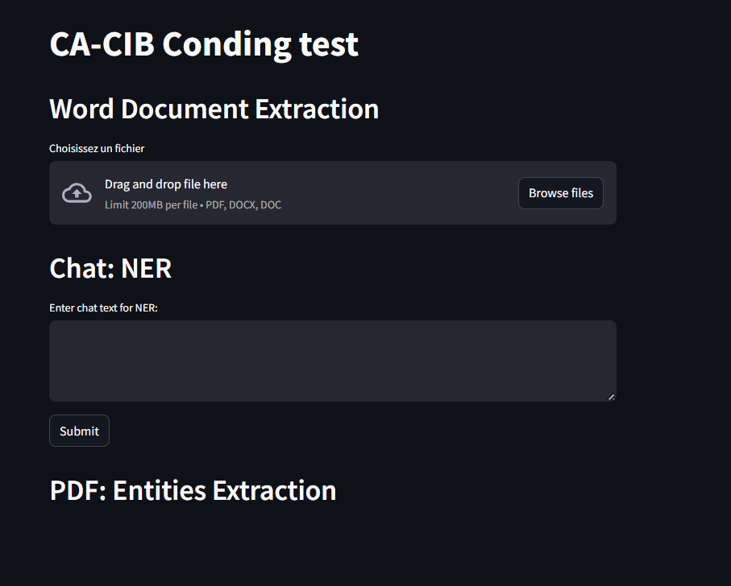

# ca-cib-coding-test


**Description** : This repository contains the code of all documents requested as part of the CA-CIB coding game.

---

## Resquested Documentation 
1. [Global Architecture Document(GAD)](./Documentation/Global%20Architecture%20Document%20(GAD).pdf)

2. [Finuetuning model for NER](./Documentation/Global%20Methodology%20Document%20(GMD)-NER%20Finetuning.pdf)
3. [Entities Extrction with LLM](./Documentation/LLMs%20Entities%20ExtractionUSING%20FONCTIOnS_cALLING.pdf)


---

## How to Launch the Application

To launch the application, follow these steps:

1. Clone the repository:
   ```bash
   git clone https://github.com/ltadjou/ca-cib-coding-test

2. Navigate to the project directory:
   ```bash
   cd ca-cib-coding-test

3. Run the following command to build and start the Docker containers:
   ```bash
   docker-compose up --build

---

## Accessing the Application

Once the containers are up and running, you can access the homepage via the following link:

- **Homepage**: [http://localhost:8501/](http://localhost:8501/) (or the appropriate port if different)
Make sure to replace `8501` with the correct port number if your application uses a different one.
You will see the following home interface.


## Upload docx/doc file and Apply NER on Chat txt
<p align="center">
  
  
</p>


## Technologies utilisées
Listez les technologies, langages, frameworks et outils utilisés dans le projet. Par exemple :
- **Langages** : Python, JavaScript
- **Frameworks** : Django, React
- **Base de données** : PostgreSQL
- **Outils** : Docker, Git, CI/CD

---

## Installation
Fournissez des instructions détaillées pour installer et configurer le projet localement. Par exemple :
```bash
# Cloner le dépôt
git clone https://github.com/votre-utilisateur/votre-projet.git

# Accéder au répertoire du projet
cd votre-projet

# Installer les dépendances
pip install -r requirements.txt

# Lancer le serveur
python manage.py runserver